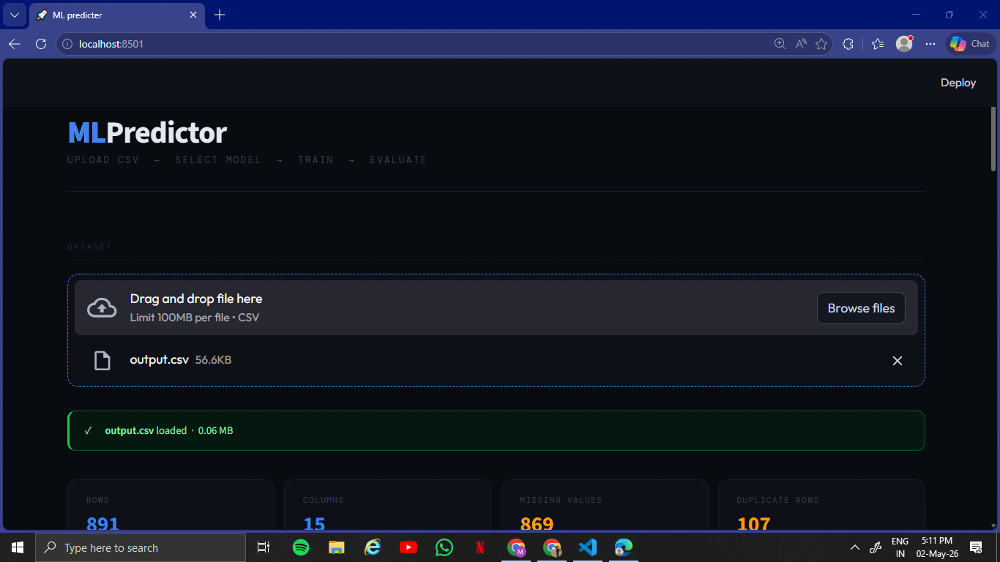

# 🚀 MLPredictor
              
> Upload a CSV. Clean it. Encode it. Find what matters. Train a model. Done. 

MLPredictor is a no-code machine learning web app built with Streamlit that takes you from raw data to a trained, downloadable ML model — all in one place, no coding required. 



---

## What can it do?

### 🔍 Overview
Get an instant summary of your dataset — shape, data types, missing values, duplicates, and a statistical breakdown of every column.

### 📊 Column Analyser
Select any column and explore it visually. Numeric columns get a distribution chart + box plot. Categorical columns get a bar chart + pie chart — with skewness, mean, median, and more.

### 🧹 Fill Missing Values
Handle missing data with Mean, Median, or Mode filling. Delete unwanted columns. Reset to original anytime.  

### 🔢 Encoding
Convert categorical columns to numbers using Label Encoding, One Hot Encoding, or Manual (Ordinal) Encoding. Undo any step or reset the entire dataset.

### 🎯 Feature Importance
Find out which features actually matter for your target variable. Uses Random Forest under the hood and visualizes importance scores as a clean bar chart.

### 🤖 Model Training
Train a machine learning model with one click — no code needed.
- **Classification:** Logistic Regression, KNN, SVM, Decision Tree, Random Forest
- **Regression:** Linear Regression, KNN, SVM, Decision Tree, Random Forest
- Auto-detects task type (classification vs regression)
- Auto-scales features when needed
- Auto-applies PCA for high-dimensional data
- Shows Accuracy / R² / MAE / RMSE / Confusion Matrix
- Download your trained model as a `.pkl` file

---

## Tech Stack

| Library | Purpose |
|---|---|
| Streamlit | Web UI |
| Pandas & NumPy | Data processing |
| Scikit-learn | ML models & preprocessing |
| Matplotlib & Seaborn | Charts & visualizations |
| PyArrow | Fast CSV loading |

---

## Run Locally

```bash
git clone https://github.com/krishna-srivastava/ml-predictor
cd ml-predictor
pip install -r requirements.txt
streamlit run app.py
```

---

## Requirements

```
streamlit
pandas
numpy
matplotlib
seaborn
scikit-learn
pyarrow
```

---

## Notes

- Supports CSV files up to **100 MB**
- Large datasets (20k+ rows) are auto-sampled for faster training
- Trained models are exported as `.pkl` bundles (includes scaler + PCA if used)

---

## Why Not Deployed?
MLPredictor is intentionally kept as a local app.
Free cloud platforms (like Streamlit Cloud) have limited RAM and CPU — 
loading large CSVs and training ML models like Random Forest in real time 
would be extremely slow or crash entirely.
Running it locally gives you full system resources and the best experience.
Simply clone the repo and run it yourself in under a minute.
